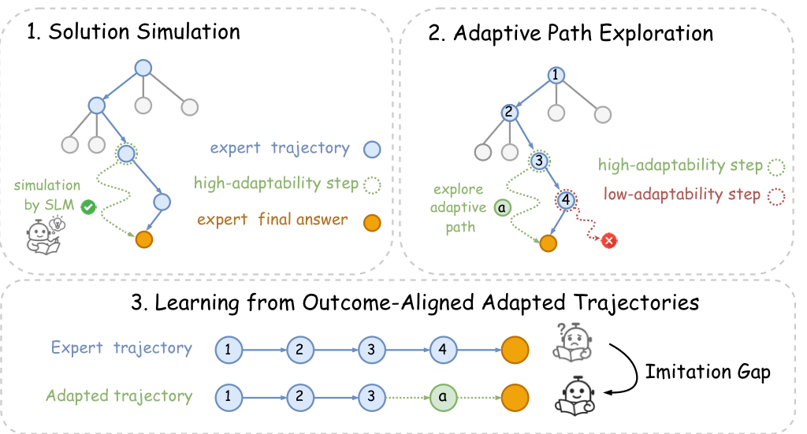

# BeyondTemplates: Dynamic Adaptation of Reasoning Demonstrations via Feasibility-Aware Exploration

[](LICENSE)
[](https://www.python.org/)
[](https://arxiv.org/abs/xxxx.xxxxx)

Official implementation of **BeyondTemplates** (DART: Dynamic Adaptation of Reasoning Trajectories), a novel framework for adapting expert-level reasoning demonstrations to diverse small language models (SLMs) through feasibility-aware selective imitation.

## 🎯 Overview

Large language models (LLMs) have achieved remarkable performance in complex reasoning tasks. A key insight from recent work is that small, high-quality instruction datasets are surprisingly effective at eliciting sophisticated reasoning abilities in large models. However, existing approaches predominantly rely on **static, pre-collected reasoning datasets** carefully curated for specific model families and training regimes.

These static datasets exhibit significant limitations when applied to models with heterogeneous pretraining distributions, such as small language models (SLMs) with different training data and reduced reasoning capabilities. Variations in model size, reasoning capability, and training history can lead to severe distribution mismatches, substantially diminishing the ability of curated data to effectively activate reasoning skills.

**BeyondTemplates** addresses these challenges by introducing a novel data adaptation framework designed to bridge the distribution gap between static reasoning datasets and diverse SLMs. Instead of enforcing uniform imitation of expert demonstrations, DART introduces a **selective imitation** strategy guided by **imitation feasibility estimation**.

## 🏗️ Method

Our framework comprises three key components:



### 1. Step-wise Adaptability Estimation via Solution Simulation

For each step provided by the expert, DART dynamically assesses the likelihood that the student model can successfully complete the reasoning process conditioned on adopting that step. This is achieved through Monte Carlo simulation-based methods that estimate the feasibility of imitation per step, allowing selective supervision tailored to the student model capabilities.

### 2. Imitation Gap Detection and Adaptive Path Exploration

When imitation is deemed infeasible, the student autonomously explores alternative trajectories while maintaining the consistency of the outcome with the objective of the original task. This mechanism allows models to recover from infeasible supervision points and generate outcome-consistent alternative reasoning paths.

### 3. Learning from Outcome-Aligned Adapted Trajectories

The framework collects and learns from adapted trajectories that align with the ground-truth outcomes, enabling flexible adaptation of high-quality reasoning datasets to heterogeneous model populations.

## 🚀 Quick Start

### Installation

```bash
# Clone the repository
git clone https://github.com/WaterMaster-911/BeyondTemplates.git
cd BeyondTemplates

# Install dependencies
pip install -r requirements.txt
```

### Data Preparation

```bash
cd dart

# Prepare step-wise data from LIMO dataset
python data_process/data2step.py data/limo.jsonl data/limo_processed.jsonl

# Prepare step-wise data from Long-CoT dataset
python data_process/data2step.py data/long_cot.jsonl data/long_cot_processed.jsonl
```

### Running the Pipeline

#### 1. Start the Backend Server

```bash
cd task
bash start-server.sh
```

#### 2. Step-wise Adaptability Estimation

Run the pipeline in "build" mode to evaluate the model's performance on cumulative steps:

```bash
python dart_pipeline.py \
  --input data/limo_processed.jsonl \
  --output results/build_results.jsonl \
  --prompt_mode build \
  --repeat 4 \
  --base_url http://localhost:8000/v1 \
  --model qwen2.5-math
```

#### 3. Imitation Gap Detection and Adaptive Path Exploration

Switch to "explore" mode to continue reasoning from existing paths where gaps are detected:

```bash
python dart_pipeline.py \
  --input data/limo_processed_need_explore.jsonl \
  --output results/explore_results.jsonl \
  --prompt_mode explore \
  --repeat 10 \
  --base_url http://localhost:8000/v1 \
  --model qwen2.5-math
```

## 📊 Evaluation

Our evaluation framework is built on top of the [Qwen2.5-Math](https://github.com/Qwen/Qwen2.5-Math) repository, which provides:

- Comprehensive mathematical reasoning benchmarks
- Standardized evaluation protocols
- State-of-the-art baseline models for comparison

To evaluate the adapted reasoning trajectories:

```bash
# The evaluation scripts follow the same protocols as Qwen2.5-Math
# Please refer to the Qwen2.5-Math repository for detailed instructions
https://github.com/QwenLM/Qwen2.5-Math
```

## 🔧 Configuration

The pipeline supports various configuration options:

- **Backend**: Configurable via `backends/vllm_client.py` (supports vLLM, OpenAI-compatible APIs)
- **Models**: Specify model name, temperature, max tokens in pipeline arguments
- **Parallel processing**: Adjust `max_workers` and `batch_size` for performance optimization

Example configuration:

```bash
python dart_pipeline.py \
  --input data/input.jsonl \
  --output data/output.jsonl \
  --base_url http://localhost:8000/v1 \
  --model your-model-name \
  --max_tokens 16384 \
  --temperature 0.1 \
  --max_workers 4 \
  --batch_size 200
```

## 📈 Key Features

- **Feasibility-aware adaptation**: Dynamically assesses imitation feasibility at each reasoning step
- **Selective imitation**: Allows models to skip infeasible supervision and explore alternatives
- **Outcome consistency**: Ensures adapted trajectories maintain consistency with ground-truth outcomes
- **Flexible deployment**: Supports various backend implementations and model architectures
- **Scalable design**: Parallel processing support for large-scale dataset adaptation

## 🤝 Contributing

We welcome contributions! Please feel free to submit a Pull Request.

## 📝 Citation

If you find this work useful, please cite our paper:

```bibtex
@misc{wu2025templatesdynamicadaptationreasoning,
      title={Beyond Templates: Dynamic Adaptation of Reasoning Demonstrations via Feasibility-Aware Exploration}, 
      author={Yong Wu and Weihang Pan and Ke Li and Chen Binhui and Ping Li and Binbin Lin},
      year={2025},
      eprint={2505.20700},
      archivePrefix={arXiv},
      primaryClass={cs.CL},
      url={https://arxiv.org/abs/2505.20700}, 
}
```

## 📄 License

This project is licensed under the MIT License - see the LICENSE file for details.

## 🙏 Acknowledgments
- We thank the authors of Qwen2.5-Math for providing the evaluation framework
- We thank the LIMO and Long-CoT datasets for providing high-quality reasoning demonstrations

## 📧 Contact

For questions and feedback, please open an issue or contact [wu.yong@zju.edu.cn].

---

**Note**: This repository contains the implementation for the paper "BeyondTemplates: Dynamic Adaptation of Reasoning Demonstrations via Feasibility-Aware Exploration". If you find this work helpful, please consider starring ⭐️ the repository!